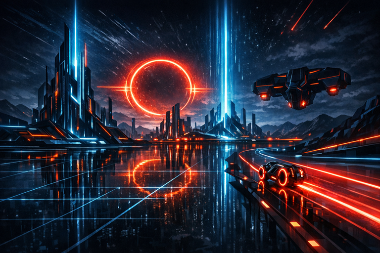
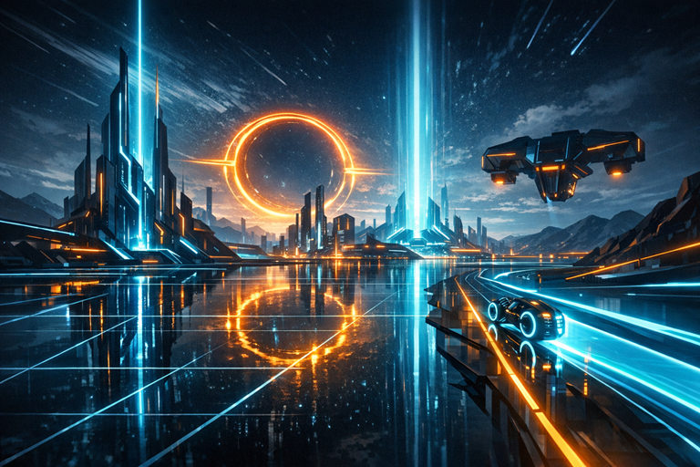

# TronGrid

<p align="center">
  
  
</p>

A single-player Vulkan game engine and renderer for a digital world where AI creatures perceive and
navigate through rendered images. One AI brain (DLL/SO plugin) can be loaded per instance.

Built from the ground up in C++20 with the Tron aesthetic — clean geometry, emissive materials,
reflective surfaces, neon glow. All core subsystems (3D rendering, physics, spatial audio, environment
sensory) are written in-house with no third-party libraries.

## Status

**Phase 2 in progress** — GPU-driven rendering with 1000 cubes, compute frustum culling,
single indirect draw call. SSBO for per-object transforms, compute shader culls invisible
objects before draw, free-flight camera (quaternion, WASD + mouse look), MathLib (63 unit
tests), event-driven multi-threaded renderer. All 5 CI presets pass.

See [docs/VISION.md](docs/VISION.md) for the full vision, architecture overview, and phased roadmap.

---

## How It Works

TronGrid always starts as a console application. Two launch-time modes:

| Mode | Launch | Behaviour |
|------|--------|-----------|
| **Human** | `trongrid` | Creates a window, renders to screen, audio to speakers, keyboard/mouse input |
| **Bot** | `trongrid --bot brain.dll` | Stays in console, renders offscreen, routes senses through shared memory to the AI brain |

The AI brain is a DLL (Windows) or SO (Linux) — an independent project with its own architecture.
TronGrid provides a standalone C-linkage interface header; the brain's internals are none of
TronGrid's business. The AI interface specification will be documented in a future phase.

---

## Platforms

| Platform | Windowing | Status |
|----------|-----------|--------|
| Windows  | Win32     | Active |
| Linux    | X11       | Active |

## Requirements

- **Vulkan SDK** 1.4.335.0+ ([LunarG](https://vulkan.lunarg.com/))
- **C++20** compiler (MSVC, GCC, or Clang)
- **CMake** 3.16+
- **Ninja** build system

### Development Reference Hardware

| Component | Specification |
|-----------|---------------|
| CPU | Intel Core i9-14900HX (24 cores / 32 threads) |
| GPU | NVIDIA GeForce RTX 4090 Laptop GPU (Ada Lovelace) |
| VRAM | 16 GB GDDR6 |
| RAM | 64 GB DDR5-5600 (2 x 32 GB) |
| Storage | ~10 GB NVMe |
| OS | Windows 11 / Ubuntu 24.04 LTS |
| Vulkan | 1.4.335.0+ |

**Target:** 4K @ 60+ FPS with full ray tracing

### Required Vulkan Extensions

```text
VK_EXT_mesh_shader              // Task + Mesh shaders
VK_KHR_acceleration_structure   // RT acceleration structures
VK_KHR_ray_tracing_pipeline     // RT pipeline
VK_KHR_deferred_host_operations // Async AS builds
VK_KHR_buffer_device_address    // GPU pointers for bindless
VK_EXT_descriptor_indexing      // Bindless resources
```

## Building

### Windows (MSVC)

```bash
cmake --preset windows-msvc
cmake --build build/windows-msvc --config Debug
```

### Windows (Clang-CL)

```bash
cmake --preset windows-clang-cl
cmake --build build/windows-clang-cl --config Debug
```

### Linux (GCC)

```bash
sudo apt-get install libxcb1-dev
cmake --preset linux-x11-gcc
cmake --build build/linux-x11-gcc --config Debug
```

### Linux (Clang)

```bash
sudo apt-get install libxcb1-dev
cmake --preset linux-x11-clang
cmake --build build/linux-x11-clang --config Debug
```

## Design Principles

1. **Don't over-engineer** — no abstractions until there's a concrete second use case
2. **Write everything ourselves** — rendering, physics, audio, sensory — all in-house
3. **Minimal external dependencies** — Vulkan SDK, Volk, vulkan-hpp, VMA, Slang — nothing else
4. **GPU-driven** — minimal CPU involvement in rendering decisions
5. **Physically based** — ray traced lighting, real-world units (metres), correct light transport
6. **Incremental** — every phase produces visible, demonstrable results

## Key Design Decisions

| Decision | Choice | Rationale |
|----------|--------|-----------|
| Coordinate system | Right-handed, Y-up | Matches glTF, most tools |
| Units | Metres | Physically-based lighting |
| Colour space | Linear internal, sRGB output | Correct blending |
| HDR range | 16-bit float | Emissive glow needs headroom |
| Meshlet size | 64 verts, 124 triangles | NVIDIA optimal |
| Descriptor model | Fully bindless | No rebinding, GPU-driven |
| Present mode | MAILBOX | Low latency, no tearing |
| Shader language | Slang | Modern, modular, multi-target |
| Vulkan loader | Volk | Dynamic loading, no link dependency |
| Vulkan C++ bindings | vulkan-hpp (`vk::raii`) | RAII ownership, type safety |
| Rendering model | Dynamic rendering | No VkRenderPass/VkFramebuffer |
| Internal libraries | Static libs under `libs/` | Self-contained LEGO bricks, future submodule-ready |

## Documentation

| Document | Purpose |
|----------|---------|
| [docs/VISION.md](docs/VISION.md) | Project vision, phased roadmap (single source of truth) |
| [docs/ARCHITECTURE.md](docs/ARCHITECTURE.md) | Technical architecture and engine design |
| docs/AI_INTERFACE.md | AI brain plugin interface specification (future) |
| [STYLE.md](STYLE.md) | Code style conventions |
| [CONTRIBUTING.md](CONTRIBUTING.md) | Contributor guidelines |
| [TODO.md](TODO.md) | Active tasks and development journal |

---

## The Vision

> A digital creature will wake up in this world.
> It will see neon lines against infinite black.
> It will learn that glowing boundaries mean "wall."
> It will discover movement, space, self.
>
> The first AI to achieve grounded spatial awareness
> won't stumble through a grey test scene —
> it will blaze across a light cycle grid,
> reflections trailing behind it,
> living in a world that looks like the future we were promised.

---

## Contributing

Contributions welcome! See [CONTRIBUTING.md](CONTRIBUTING.md) for guidelines.

- Follow the style guide in [STYLE.md](STYLE.md)
- Security issues: see [SECURITY.md](SECURITY.md)

---

## Licence

Copyright (C) 2026 Matej Gomboc <https://github.com/MatejGomboc/tron-grid>.

GNU General Public License v3.0 — see [LICENCE](LICENCE).

---

## Links

- [Vulkan Tutorial](https://vulkan-tutorial.com)
- [vkguide.dev](https://vkguide.dev)
- [Sascha Willems Vulkan Samples](https://github.com/SaschaWillems/Vulkan)
- [meshoptimizer](https://github.com/zeux/meshoptimizer)
- [Slang Shader Language](https://shader-slang.org)
- [Report an Issue](https://github.com/MatejGomboc/tron-grid/issues)
